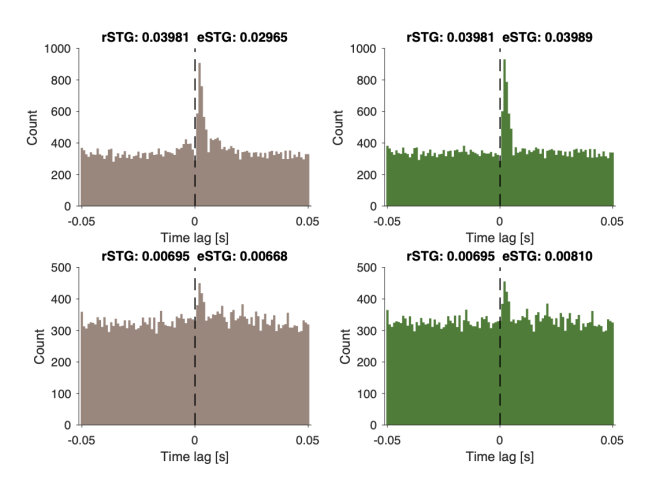
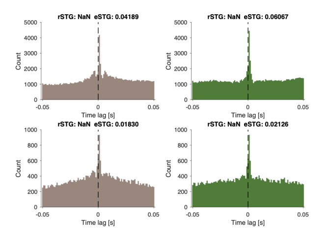

# CCH-deconvolution-
Deconvolution algorithm for removing burst spiking artifacts from CCH

## Overview
The core CCH deconvolution algorithm described by Spivak et al. is implemented by the MATLAB routine cchdeconv.m

To estimate spike transmission (quantification and detection) between two spike trains, use the routine cch_stg.m. This routine takes as inputs a CCH (or CCHs), ACHs, and the number of spikes in each corresponding spike train.

To compute CCHs and ACHs from spike trains, you must use an external routine (not part of this directory). One option is [CCG.m,](https://github.com/michael-zugaro/FMAToolbox/blob/master/Analyses/CCG.m) available from [FMAToolbox](https://github.com/michael-zugaro/FMAToolbox). 

## Demo
To demonstrate the entire pipeline from multiple labelled spike trains, a cch_stg_demo.m is available. To run the demo, you will need the following:

### Routines (CCH deconvolution)
- cch_stg_demo.m
  - the demo, calls all other routines
- call_cch_stg.m
  - computes dcCCHs and eSTGs from multiple spike trains 
- cch_stg.m
  - computes dcCCHs and eSTGs from CCHs, ACHs, and spike counts
- cchdeconv.m
  - computes dcCCHs from CCHs, ACHs, and spike counts
- cch_conv.m
  - computes predictors from dcCCHs or CCHs
- calc_stg.m 			
  - computes STGs from crCCHs

### Data
- simData.mat
  - Spike trains simulated over 6 hours 
  - Eight pairs, with strong/weak excitatory/inhibitory connections, with/without bursts
- CA1_Data.mat 	
  - Spike trains of 6 units, recorded from CA1 of a freely-moving mouse over ~5 hours
  - Units 1-4 are putative PYR, units 5 and 6 are are putative INT

### External dependencies (FMAToolbox)
- [CCG.m](https://github.com/michael-zugaro/FMAToolbox/blob/master/Analyses/CCG.m)
- [CCGEngine.c (requires compilation)](https://github.com/michael-zugaro/FMAToolbox/blob/master/Analyses/private/CCGEngine.c)
- [isastring.m](https://github.com/michael-zugaro/FMAToolbox/blob/master/Helpers/isastring.m)
- [isdscalar.m](https://github.com/michael-zugaro/FMAToolbox/blob/master/Helpers/isdscalar.m)
- [isdvector.m](https://github.com/michael-zugaro/FMAToolbox/blob/master/Helpers/isdvector.m)
- [Smooth.m](https://github.com/michael-zugaro/FMAToolbox/blob/master/General/Smooth.m)

### To run the demo
- Download all routines, data, and external dependencies
- In MATLAB, write cch_stg_demo.m

## Demo results

### Simulated spike trains

### Real spikes trains from mouse CA1

